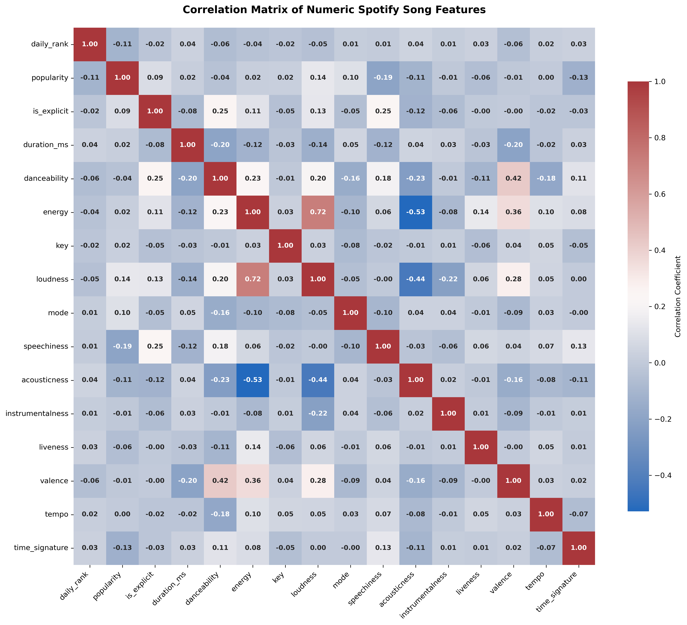
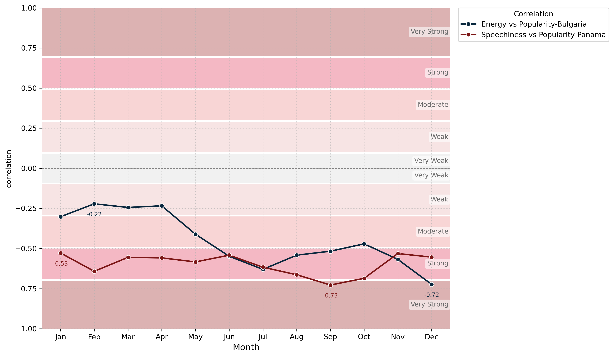
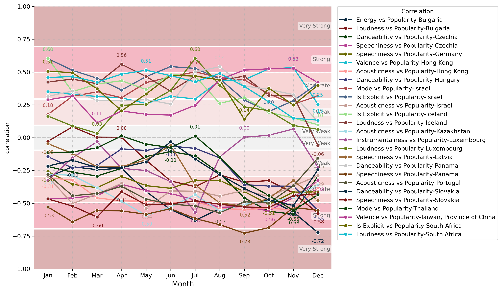
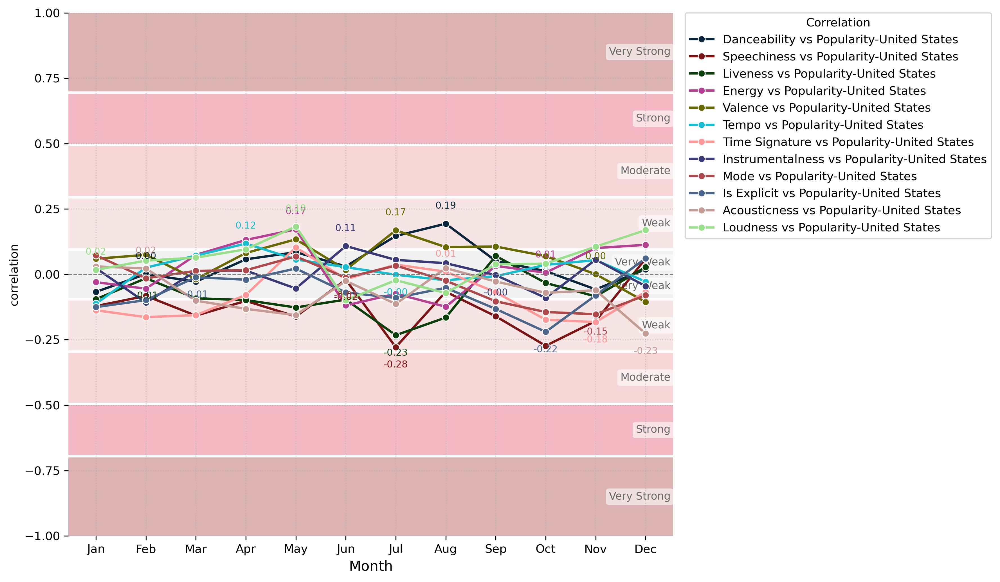
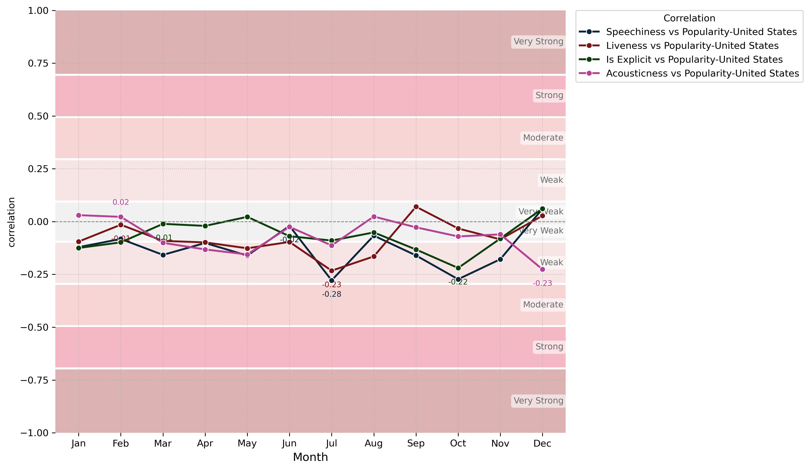
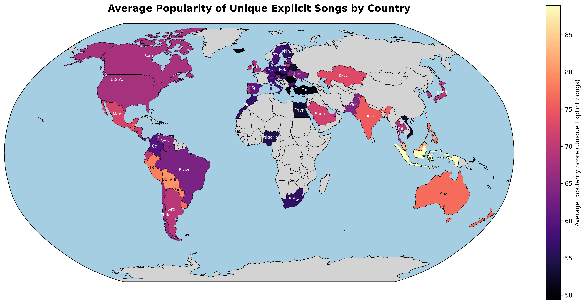

# What Makes a Song Popular? <br> Untangling the Chaos with a Data-Driven Approach.

Decoding the DNA of Hit Songs

1. [Project Overview](#part-1-project-overview)  
    - [Description](#description)  
        - [Dataset](#dataset)  
        - [Technologies Used](#technologies-used)  
        - [Key Analyses & Insights](#key-analyses--insights)  
    - [Features](#features)  
2. [Setup](#part-2--setup)  
    - [Prerequisites](#prerequisites)  
    - [Installation](#installation)  
    - [Database Setup](#database-setup)  
3. [Data Analysis](#part-3--data-analisis)  
    - [Introduction](#introduction)  
    - [Data Cleaning](#data-cleaning)  
    - [Data Analysis](#data-analisis)  
    - [Jupyter Notebook](#jupyter-notebook)  
    - [Interpretation of Correlation Strength](#interpretation-of-correlation-strength)  
    - [Static Parameter](#static-parameter)  
    - [Dynamic](#dynamic)  
    - [United States Only](#united-states-only)  
    - [Monthly Correlation by Country](#monthly-correlation-by-country)  
    - [Explicit Content Analysis](#explicit-content-analysis)  
    - [Conclusion](#conclusion-what-makes-a-song-popular-untangling-the-chaos-with-a-data-driven-approach)  
4. [Contact](#contact)

## Part 1: Project Overview
### Description

This project analyzes a dataset of daily top 50 Spotify songs from 72 countries and globally, covering the period from October 18, 2023, to June 11, 2025 (date of download; the latest data may vary). The primary goal is to determine how music features obtained through the Spotify API, such as danceability, loudness, and explicitness, relate to a song's popularity and daily rank.

While multiple exploratory analyses are included, the main focus is on understanding how static song attributes (e.g., danceability, loudness, explicitness) relate to dynamic performance metrics (e.g., popularity score, daily chart position). It focuses on understanding the impact of fixed song attributes on listener reception, aiming to shed light on crucial decisions like optimal release timing or predicting a song's acceptance in specific regions.

The initial phase of this project involved extensive data cleaning using PostgreSQL. The raw dataset presented significant challenges, including empty rows, inconsistencies, and out-of-range values. For the subsequent analysis, only data from the year 2024 was extracted to ensure a clear and well-defined study period. The second part of the project utilizes Jupyter Notebooks for in-depth exploration and visualization. All cleaning scripts and analytical notebooks have been structured into a well-organized Python program, also included in this repository.


#### Dataset

The dataset used for this analysis is sourced from Kaggle: [Top Spotify Songs in 73 Countries (Daily Updated)](https://www.kaggle.com/datasets/asaniczka/top-spotify-songs-in-73-countries-daily-updated)

---

#### Technologies Used

* **PostgreSQL:** For robust data cleaning, transformation, and management.
* **Python:**
    * **Jupyter Notebooks:** For interactive data exploration, analysis, and visualization.
    * **Pandas:** For data manipulation and analysis.
    * **Matplotlib/Seaborn:** For creating insightful visualizations.
    * **Psycopg:** For Python-PostgreSQL database interaction.

---

#### Key Analyses & Insights
* Identifying **correlations** between all numerical features across the entire dataset
* Analyzing **temporal** trends in song popularity and feature distribution across months of 2024.
* Uncovering **geographical** variations in musical explicitness and popularity across different countries.

### Features
-   **Comprehensive Data Cleaning:** Robust PostgreSQL scripts to handle missing values, inconsistencies, and out-of-range data in the raw Spotify dataset.
-   **Music Feature Analysis:** In-depth exploration of how Spotify API-derived features (e.g., danceability, loudness, explicitness) correlate with song popularity and daily rank.
-   **Temporal Trend Analysis:** Investigate how song popularity and feature distribution evolve across months (specifically focusing on 2024 data).
-   **Geographical Popularity Insights:** Uncover variations in musical preferences and chart performance across 72 countries and global charts.
-   **Reproducible Analysis:** Jupyter Notebooks for interactive exploration and visualization, complemented by a well-structured Python program for repeatable analysis.

## Part 2 : Setup

### Prerequisites
* **Python 3.8+** (or a distribution like **Anaconda** which includes Python and pip)
* **pip** (Python package installer, usually included with Python or Anaconda)
* **PostgreSQL database**

### Installation

1.  **Clone the repository:**
    ```bash
    git clone [https://github.com/itsmeluisc/spotify_data_analysis.git](https://github.com/itsmeluisc/spotify_data_analysis.git)
    cd spotify_data_analysis
    ```
2.  **Create and activate a virtual environment (recommended):**
**Using `venv`:**
    ```bash
    python -m venv venv
    source venv/bin/activate  # On Linux/macOS
    .\venv\Scripts\activate   # On Windows
    ```

    **Using Conda:**
    ```bash
    conda create -name spotify_env python=3.12  # Create an environment named 'spotify_env' with Python 3.9
    conda activate spotify_env                  # Activate the environment
3.  **Install dependencies:**
    ```bash
    pip install -r requirements.txt
    ```
4.  **Database Setup:**
    * Ensure your PostgreSQL database is running.
    * Update database connection details in `config.py` (or your equivalent config file).
    * Modify the file path in [sql/02_ingest_raw_data.sql](sql/02_ingest_raw_data.sql) to point to your downloaded CSV. [Top Spotify Songs in 73 Countries (Daily Updated)](https://www.kaggle.com/datasets/asaniczka/top-spotify-songs-in-73-countries-daily-updated)

## Part 3 : Data Analisis 
### Introduction
The dataset used in this project was downloaded from [Top Spotify Songs in 73 Countries (Daily Updated)](https://www.kaggle.com/datasets/asaniczka/top-spotify-songs-in-73-countries-daily-updated) in CSV format. It was then imported, cleaned, and stored in a PostgreSQL database to ensure consistency and enable efficient querying.

Subsequently, a Jupyter Notebook was used to perform data visualization, deeper analysis, and generate meaningful plots. This structured approach enables both exploratory and targeted analysis of how various musical features relate. 

### Data Cleaning 
This phase has been, by far, the most time-consuming part of the project. A new table named spotify_songs_staging was created with all columns defined as TEXT (see -> [sql/01_create_staging_table.sql](sql/01_create_staging_table.sql)). This decision was intentional: by loading all data as text initially, we eliminated the risk of type-related loading errors and retained full flexibility during data exploration and transformation. This is a widely used approach in data processing pipelines, especially when dealing with inconsistent or messy datasets, as it allows early detection of malformed values before imposing strict type constraints.

The raw data was then ingested into the staging table (see -> [sql/02_ingest_raw_data.sql](sql/02_ingest_raw_data.sql)), and a first-pass quality analysis was performed (see -> [sql/07_analize_raw_data_quality.sql](sql/07_analize_raw_data_quality.sql)). The table below summarizes the initial results:


| variable_name       | empty_string_count | null_count |
|---------------------|--------------------|------------|
| spotify_id          | 0                  | 0          |
| time_signature      | 0                  | 0          |
| tempo               | 0                  | 0          |
| valence             | 0                  | 0          |
| liveness            | 0                  | 0          |
| instrumentalness    | 0                  | 0          |
| acousticness        | 0                  | 0          |
| speechiness         | 0                  | 0          |
| artists             | 29                 | 0          |
| daily_movement      | 0                  | 0          |
| country             | 28908              | 0          |
| popularity          | 0                  | 0          |
| duration_ms         | 0                  | 0          |
| album_release_date  | 659                | 0          |
| energy              | 0                  | 0          |
| loudness            | 0                  | 0          |
| name                | 30                 | 0          |
| daily_rank          | 0                  | 0          |
| weekly_movement     | 0                  | 0          |
| snapshot_date       | 0                  | 0          |
| is_explicit         | 0                  | 0          |
| album_name          | 822                | 0          |
| danceability        | 0                  | 0          |
| key                 | 0                  | 0          |
| mode                | 0                  | 0          |


A high number of empty string values was identified, particularly in the country column. This is expected behavior since global Top 50 tracks, which are common in the dataset, have no country associated. Other columns such as album_name, album_release_date, and some artist names also exhibited similar issues.

The next step, defined in (see -> [sql/03_clean_and_transform_staging.sql](sql/03_clean_and_transform_staging.sql)), involved converting all empty strings to NULL values. After that, each column was cast to the most efficient and appropriate data type based on the Spotify documentation [Spotify Web API: Get Audio Features](https://developer.spotify.com/documentation/web-api/reference/get-audio-features). The transformation was performed using the following query:

```sql
ALTER TABLE spotify_songs_staging
    ALTER COLUMN spotify_id TYPE CHAR(22) USING spotify_id::CHAR(22), -- Explicitly casts existing values to CHAR(22)
    ALTER COLUMN daily_rank TYPE SMALLINT USING daily_rank::SMALLINT, -- smallint: Custom rank (not from Spotify)
    ALTER COLUMN daily_movement TYPE SMALLINT USING daily_movement::SMALLINT, -- smallint: Custom daily rank movement
    ALTER COLUMN weekly_movement TYPE SMALLINT USING weekly_movement::SMALLINT, -- smallint: Custom weekly rank movement
    ALTER COLUMN country TYPE CHAR(2) USING country::CHAR(2), -- string: ISO 3166-1 alpha-2 country code
    ALTER COLUMN snapshot_date TYPE DATE USING NULLIF(snapshot_date, '')::DATE, -- date: Snapshot date for the metrics
    ALTER COLUMN popularity TYPE SMALLINT USING popularity::SMALLINT, -- integer: Popularity (0–100)
    ALTER COLUMN is_explicit TYPE BOOLEAN USING is_explicit::BOOLEAN, -- boolean: True if track is marked explicit
    ALTER COLUMN duration_ms TYPE INTEGER USING duration_ms::INTEGER, -- integer: Track duration in milliseconds
    ALTER COLUMN album_name TYPE TEXT, -- string: Album name
    ALTER COLUMN album_release_date TYPE DATE USING NULLIF(album_release_date, '')::DATE, -- date: Album release date
    ALTER COLUMN danceability TYPE REAL USING danceability::REAL, -- float: 0.0–1.0; dance suitability
    ALTER COLUMN energy TYPE REAL USING energy::REAL, -- float: 0.0–1.0; perceptual intensity
    ALTER COLUMN key TYPE SMALLINT USING key::SMALLINT, -- integer: Musical key (-1 = unknown, 0 = C, ..., 11 = B)
    ALTER COLUMN loudness TYPE REAL USING loudness::REAL, -- float: Average loudness in dB
    ALTER COLUMN mode TYPE BOOLEAN USING mode::BOOLEAN, -- boolean: 0 = minor, 1 = major
    ALTER COLUMN speechiness TYPE REAL USING speechiness::REAL, -- float: 0.0–1.0; presence of spoken words
    ALTER COLUMN acousticness TYPE REAL USING acousticness::REAL, -- float: 0.0–1.0; confidence the track is acoustic
    ALTER COLUMN instrumentalness TYPE REAL USING instrumentalness::REAL, -- float: 0.0–1.0; likelihood of being instrumental
    ALTER COLUMN liveness TYPE REAL USING liveness::REAL, -- float: 0.0–1.0; probability the track is live
    ALTER COLUMN valence TYPE REAL USING valence::REAL, -- float: 0.0–1.0; musical positiveness
    ALTER COLUMN tempo TYPE REAL USING tempo::REAL, -- float: Beats per minute
    ALTER COLUMN time_signature TYPE SMALLINT USING time_signature::SMALLINT;
```
After completing the type conversions, a consistency check was performed. It was found that some songs (identified by spotify_id) had inconsistent values for name and artists across different rows. To resolve this, those values were standardized so that each spotify_id had a unique and consistent name and artist.

To address missing or out of range values, a backfilling strategy was used. This strategy applied the most recent valid (non-null and within range) value for each spotify_id to fill in missing values, limited to non-time-dependent fields. For example, audio features such as danceability, energy, and valence were filled using this method, ensuring consistent metadata across the dataset.

All rows with missing country values were set to 'ZZ', a placeholder indicating global data. Additionally, all rows where name remained NULL after processing were removed, as the track name is considered essential for analysis.

This multi step cleaning and transformation process provided a reliable foundation for building a consistent analytical dataset. Some values could not be restored during this process, and while enriching the dataset using the Spotify API would be beneficial, it falls outside the scope of this project.


| variable_name      | null_count |
|--------------------|------------|
| spotify_id         | 0          |
| time_signature     | 0          |
| tempo              | 0          |
| valence            | 0          |
| liveness           | 0          |
| instrumentalness   | 0          |
| acousticness       | 0          |
| name               | 0          |
| daily_rank         | 0          |
| weekly_movement    | 0          |
| snapshot_date      | 0          |
| is_explicit        | 0          |
| album_name         | 792        |
| danceability       | 0          |
| key                | 0          |
| mode               | 0          |
| artists            | 0          |
| daily_movement     | 0          |
| country            | 0          |
| popularity         | 0          |
| duration_ms        | 0          |
| album_release_date | 630        |
| energy             | 0          |
| loudness           | 0          |
| speechiness        | 0          |

Final data preparation steps included indexing the cleaned table (see -> [sql/04_finalize_and_index_main_table.sql](sql/04_finalize_and_index_main_table.sql)), filtering it to include only records from the year 2024 (see -> [sql/05_create_2024_table.sql](sql/05_create_2024_table.sql)), and casting boolean fields to integers for smoother numerical analysis (see -> [sql/06_final_type_adjustments.sql](sql/06_final_type_adjustments.sql)).


### Data Analisis 

The first step in any data analysis project is to understand what the dataset measures, what the values represent, and what relationships are expected. This analysis focuses on how static song attributes (such as loudness or danceability) influence dynamic performance metrics (like daily rank or popularity).

It is important to note that many external factors, such as social media, advertising, or cultural events, may influence a song’s popularity. These external influences are assumed unknown in this analysis.

#### Jupyter Notebook

The analysis was conducted in a Jupyter Notebook (see -> [notebooks/spotify_worldwide_daily_top_50.ipynb](notebooks/spotify_worldwide_daily_top_50.ipynb)). Wherever possible, the notebook was designed to query only the required data from the server instead of loading the entire dataset into memory, which improves performance for large datasets.

This analysis relies heavily on:

- pandas for data manipulation,

- matplotlib and seaborn for visualization,

- pycountry and cartopy for geographic plotting,

- psycopg2 for connecting and querying the local PostgreSQL database.

All database interactions are handled using a custom-defined class (see -> [src/db_client.py](src/db_client.py))..

A first correlation analysis was conducted across the entire dataset:



To interpret the heatmap, the following correlation strength guide should be used:

####  Interpretation of Correlation Strength

| Correlation Strength | Range         |
|----------------------|---------------|
| **Very Strong**      | ±0.70 to ±1.00 |
| **Strong**           | ±0.50 to ±0.69 |
| **Moderate**         | ±0.30 to ±0.49 |
| **Weak**             | ±0.10 to ±0.29 |
| **Very Weak**        |  0.00 to ±0.09 |

- Negative correlations (blue on the heatmap) indicate that when one variable is high, the other tends to be low. Keep in mind that low values can sometimes be desirable (e.g., a low daily rank means a better chart position).

- Positive correlations (red/hot on the heatmap) indicate the opposite.

#### Static Parameter 
At first glance, the strongest positive correlation is between energy and loudness. This suggests that Spotify's energy metric heavily relies on how loud a track feels to the human ear. Additionally, valence (musical positiveness) is moderately positively correlated with both danceability and energy. This indicates that upbeat, energetic tracks tend to feel more positive.

There is also a strong negative correlation between energy and acousticness, suggesting that acoustic songs tend to be less energetic and less loud.

#### Dynamic

Dynamic performance metrics such as daily_rank and popularity show little to no correlation with static features. The highest observed was a weak negative correlation between speechiness and popularity, indicating that tracks with more spoken words tend to be slightly less popular.

Interestingly, even the correlation between daily_rank and popularity is weak, meaning that one does not predict the other well across the full dataset. This implies that external influences likely play a dominant role.


#### United States Only
Correlation matrix for the United States:


Results are consistent with the global data. Therefore, a deeper analysis is necessary to uncover more detailed patterns.

#### Monthly Correlation by Country

To determine where static attributes are strongly correlated with popularity, a threshold-based line plot was created. First, we checked if any combination across all countries exceeded a very strong correlation (>|0.7|) with popularity:



Findings:

- In Bulgaria (December), high energy strongly predicts popularity.

- In Panama (September), low speechiness is strongly associated with popularity.

Lowering the threshold to include strong correlations (>|0.5|):



This produces many overlapping lines. The legend shows countries where at least one static feature was strongly correlated with popularity at some point in the year. It suggests that static parameters can sometimes be strong predictors of popularity depending on time and location.

For the United States, the correlationreveals weak relationships across most variables:



Narrowing focus to ≥ 0.2:

.

Findings:

- In July, popular songs tend to have lower speechiness and lower liveness (fewer signs of a live audience).

- In December, less acoustic songs show increased popularity.

This suggests certain song attributes perform better during specific times of the year. Artists could potentially use this insight to plan releases based on their track's characteristics.

#### Explicit Content Analysis
The final analysis examines whether explicit content influences song popularity across countries. This was calculated using the average popularity of unique songs by country and visualized with cartopy:



Findings:

- Explicit songs are more popular in parts of Asia, especially India.

- In contrast, less explicit songs tend to dominate popularity charts in much of Europe.

#### Conclusion: What Makes a Song Popular?</br> Untangling the Chaos with a Data-Driven Approach
This project set out to demystify the factors that drive a song's popularity using a structured and scalable data science approach. By integrating raw Spotify Top 50 charts across 72 countries with feature-rich metadata from the Spotify API, and then applying rigorous data cleaning, transformation, and correlation analyses, the project paints a nuanced picture of how various musical attributes relate to public reception.

Several key findings emerged:

- Static song attributes, such as energy, loudness, and danceability, display meaningful correlations among themselves. For example, loudness and energy are strongly positively correlated, suggesting that more intense or "energetic" songs are generally louder.

- Valence, a measure of musical positiveness, tends to increase with danceability and energy, confirming intuitive associations between upbeat moods and rhythmic intensity.

- Acousticness negatively correlates with both loudness and energy, indicating that acoustic songs are generally quieter and less energetic, possibly due to their stripped-down production style.

However, when it comes to dynamic performance metrics like daily chart position and popularity score, the story becomes more complex. These variables showed only weak correlations with static features. This suggests that while certain song characteristics may influence how a track feels or is structured, popularity is largely driven by external factors not captured in this dataset—such as marketing campaigns, playlist placements, social media trends, or cultural events.

Localized insights add another layer to the analysis. For example:

- In Bulgaria (December), high-energy songs strongly predicted popularity.

- In Panama (September), tracks with lower speechiness (fewer spoken words) topped the charts.

- In the United States, speechiness and liveness were mildly negatively correlated with popularity in July, while acousticness saw a positive spike in December.

These seasonal and geographic variations suggest that audience preferences are dynamic and context sensitive, opening the door for artists and producers to time their releases or tailor content more strategically.

Lastly, the analysis of explicit content provided a cultural snapshot: explicit songs are more popular in parts of Asia, particularly India, while Europe leans toward cleaner lyrical content.

##### Final Thoughts
By combining robust data engineering with domain driven exploratory analysis, this project delivers both a methodological blueprint and actionable insights. While it doesn’t attempt to predict a song’s virality outright, it provides a solid foundation for understanding how musical DNA might influence reception especially when paired with local and temporal context.

Future work could expand by integrating social listening data, playlist dynamics, or real time streaming trends, and by using machine learning models to further explore predictive potential

### Contact
Luis Castillo - itsmeluisc@gmail.com

Project Link: [https://github.com/itsmeluisc/spotify_data_analysis](https://github.com/itsmeluisc/spotify_data_analysis)
